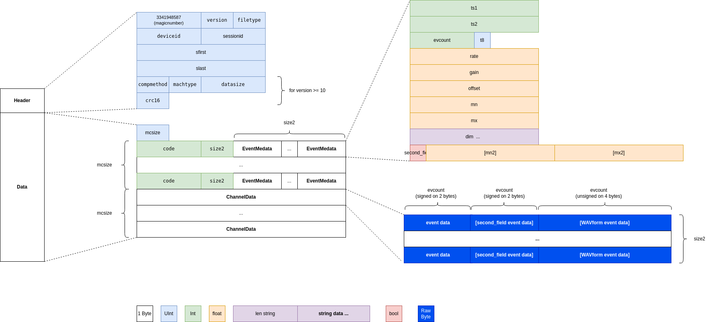
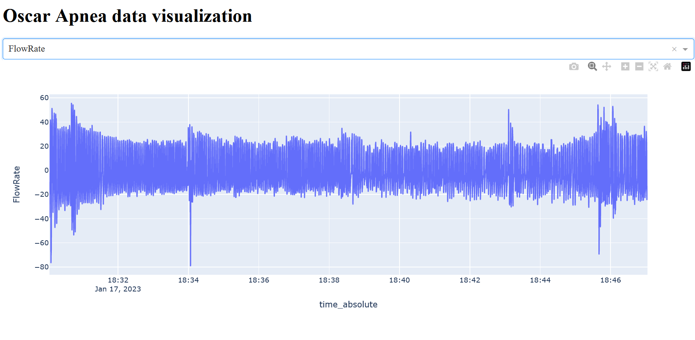

# Apnea
Studying and analyzing CPAP and other apnea data from OSCAR application 

The objective here is to provide tools to read OSCAR data to be used in machine learning tools.

## Requirements 
(outside requirements.txt)
- Hexinator 1.12+ (for .grammar, for debuging, not complete)

## Data

Testing data (in data/) is one nap I took (about 15 minutes). Not all events are present in this file (no apnea event for example)

## Advancement
At the moment, this is a first Proof of concept to read session files (.001 files).

## Session file data format

## Visualisation

A little Dash application is used to visualize data

